<!-- Matrix Rain Header Banner -->
<div align="center">
  
</div>

<!-- Animated Typing Header -->
<div align="center">
  
  

</div>

---

<!-- Main Content: ASCII Cicada + Fastfetch-style info, all in one ANSI block -->

```ansi
$ icefetch

                             .                              icebell@nastybox
                            ___                             ----------------
                          .'   '.                           Uptime      : 5 years
                         '  .-.  '                          Languages   : Java, Python, JS/TS, PHP
      .;loooooooooooooool;.( o ).;loooooooooooooool;.       Frameworks  : Springboot, Nextjs, Angular, Laravel
   .:oooooooooooooooooooooo'-.-':oooooooooooooooooooooo:.   OS          : Arch Linux
  .;ooooooooooooooooooooooc;|=|ooooooooooooooooooooooc;.    Shell       : Bash
      .;oooooooooooooooooool|=|oooooooooooooooooool;.       Editor      : VS Code
           'ooooooooooooooc |=| ooooooooooooooc'            Terminal    : Kitty
           'coooooooooooooo |=| ooooooooooooooc'            Hobby       : Side projects, web dev, tech blogs
        ':coooooooooooooo   |=|   ooooooooooooool:'    
       ':ooooooooooooooc   |===|    ooooooooooooooc:'       Interests   : AI/ML, systems, cybersecurity
       ':loooooooooo       |===|       oooooooooool:'         
           ':cool:'        |===|        ':looc:'            Achievements: Magna Cum Laude, Best Thesis
                          |=====|                             
                          |=====|                           ----------------
                           |===|                                 
                            |=|                                  
                             '                                   
```

[Portfolio](https://vencentdev.vercel.app) ·
[LinkedIn](https://l1nk.dev/ljuky3g) ·
[Email](mailto:genervencentdelute@gmail.com)

---

## <samp>`> ./about_me.sh`</samp>

```bash
const icebell = {
    alias       : "ICE BELL",
    role        : "Software Engineer",
    location    : "[REDACTED]",
    currentWork : "Building side projects and breaking things to learn how they work",
    learning    : ["AI / ML", "Systems Programming", "Offensive Security"],
    askMeAbout  : ["web dev", "backend", "linux", "ai"],
    motto       : "The quieter you become, the more you can hear."
};
```

---

## <samp>`> ./tech_stack.sh`</samp>

<p align="center">
  
  
  
  
  
  
  
  
  
  
  
  
  
  
</p>

---

## <samp>`> ./stats.sh`</samp>

<p align="center">
  
  
</p>

<p align="center">
  
</p>

---

## <samp>`> ./contact.sh`</samp>

<p align="center">
  <a href="https://vencent-portfolio.vercel.app/"></a>
  <a href="https://l1nk.dev/ljuky3g"></a>
  <a href="mailto:genervencentdelute@gmail.com"></a>
  <a href="https://github.com/VencentDev"></a>
</p>

---

<div align="center">
  
</div>

<div align="center">
  <samp><sub>// "We are the cicadas. We come in waves." //</sub></samp>
</div>
