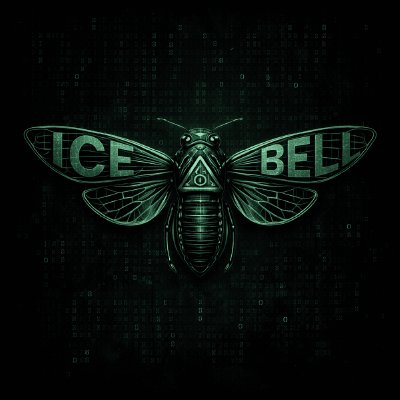

<!-- Matrix Rain Header Banner -->
<div align="center">
  
</div>

<!-- Animated Typing Header -->
<div align="center">
  
  

</div>

---

<!-- Main Content: Cicada Logo (left) + Fastfetch-style info (right) -->
<table border="0" cellpadding="0" cellspacing="0" width="100%">
<tr>
<td width="40%" align="center" valign="top">



</td>
<td width="60%" valign="top">

```ansi
[1;32m$ icefetch[0m

[1;32micebell@nastybox[0m
[1;32m----------[0m
[1;32mUptime[0m         : 18 years
[1;32mLanguages[0m      : Python, C++, Rust
[1;32mOS[0m             : Arch Linux
[1;32mDE[0m             : KDE Plasma
[1;32mWM[0m             : i3
[1;32mShell[0m          : Zsh
[1;32mEditor[0m         : Vim / VSCode
[1;32mTerminal[0m       : Alacritty
[1;32mHobby[0m          : CTF, reversing, crypto
[1;32mInterests[0m      : Cybersecurity, AI/ML
[1;32mAchievements[0m   : 2021 OII Finalist
[1;32m----------[0m
[1;32mPortfolio[0m      : https://vencent-portfolio.vercel.app/
[1;32mLinkedIn[0m       : https://l1nk.dev/ljuky3g
[1;32mEmail[0m          : genervencentdelute@gmail.com
```

</td>
</tr>
</table>

---

## <samp>`> ./about_me.sh`</samp>

```bash
const icebell = {
    alias       : "ICE BELL",
    role        : "Security Researcher & Developer",
    location    : "[REDACTED]",
    currentWork : "Hunting bugs and breaking things (legally)",
    learning    : ["Reverse Engineering", "Kernel Exploitation", "ZK Proofs"],
    askMeAbout  : ["pwn", "crypto", "low-level", "linux"],
    motto       : "The quieter you become, the more you can hear."
};
```

---

## <samp>`> ./tech_stack.sh`</samp>

<p align="center">
  
  
  
  
  
  
  
  
  
  
</p>

---

## <samp>`> ./stats.sh`</samp>

<p align="center">
  
  
</p>

<p align="center">
  
</p>

---

## <samp>`> ./contact.sh`</samp>

<p align="center">
  <a href="https://https://vencent-portfolio.vercel.app/"></a>
  <a href="https://l1nk.dev/ljuky3g"></a>
  <a href="mailto:genervencentdelute@gmail.com"></a>
  <a href="https://github.com/VencentDev"></a>
</p>

---

<div align="center">
  
</div>

<div align="center">
  <samp><sub>// "We are the cicadas. We come in waves." //</sub></samp>
</div>
